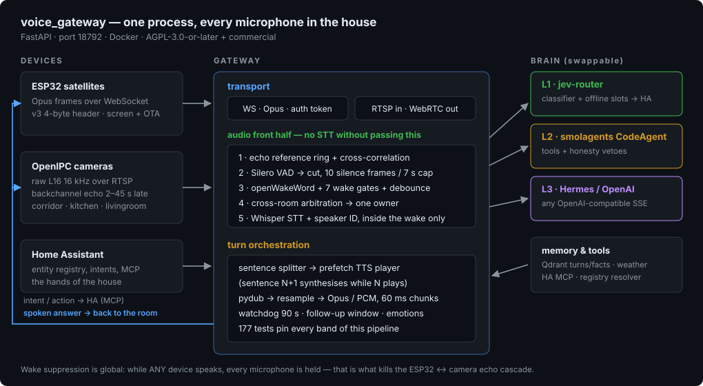
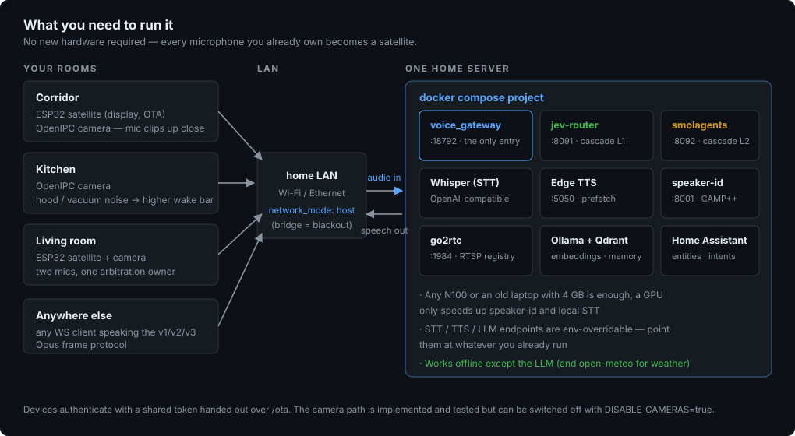
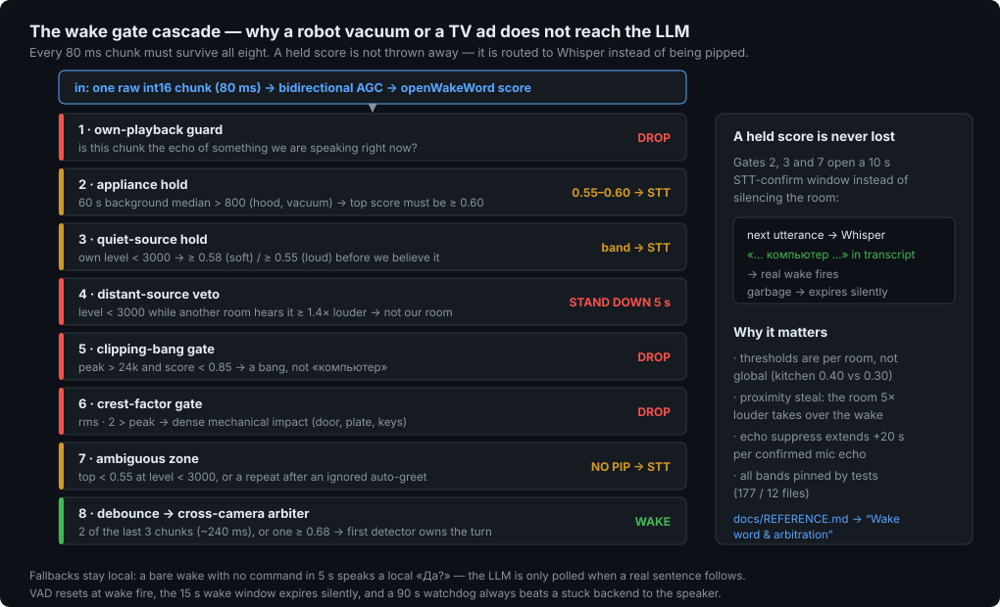

# Voice Gateway


[](https://github.com/zavaruev/voice_gateway/actions/workflows/tests.yml)


[](LICENSE)
[](https://github.com/zavaruev/voice_gateway/stargazers)
[](https://github.com/zavaruev/voice_gateway/issues)

> One process that turns every microphone in the house (ESP32 satellites and OpenIPC cameras) into a single employee, and every AI answer back into sound out of the right speaker.



FastAPI service on port **18792** that terminates the WebSocket of every ESP32 satellite speaker and the RTSP/WebRTC session of every configured camera, runs the audio front half (VAD, wake word, STT, speaker ID), hands the transcript to a pluggable LLM backend, and streams the spoken answer back to the device that asked.

---

## Why this and not something else

Home Assistant's own voice stack (Wyoming + ESPHome satellites) is the right answer if everything you own already lives inside HA. This project exists for the three things it does not cover:

| | HA + ESPHome / Wyoming satellites | **voice_gateway** |
|---|---|---|
| Microphone hardware | a purpose-built satellite board | **every ESP32 you already have, plus the mics inside your OpenIPC cameras** (RTSP backchannel, no firmware change) |
| Who answers | one conversation agent | a 3-level cascade: offline intent router → code agent with honesty vetoes → any OpenAI-compatible LLM |
| Several rooms hearing one utterance | preferred-satellite selection | per-chunk arbitration with a proximity steal (the room 5× louder takes the wake) and per-room wake thresholds |
| Who is speaking | — | CAMP++ speaker embeddings, cross-device speaker lock |
| False-wake protection | per-device threshold | an 8-gate cascade (echo ring, appliance noise, distance, clipping, crest factor, …) with a Whisper confirm-rescue band instead of silence |

The camera subsystem is **in test operation** since 04.10.2026 — living room first, kitchen joined 06.10.2026 once its `audio.volume` was raised from 30 to 100 (it read `rms 4`, −77.4 dB, and the decoder had nothing to decode): the wake word there is detected by **decoding** it with a local vosk model (`vosk_wake.py`, 88 MB, CPU-only) rather than by scoring it acoustically — a head trained on 27 recordings of the word learned the envelope instead of the word and fired 114–229 times per hour on the television. Measured: 5/5 live detections, 0 false accepts over 7 minutes of TV. Set `WAKE_VOSK_MODEL_<NAME>` to enable per room; without it a room keeps the acoustic path. See [`docs/REFERENCE.md`](docs/REFERENCE.md) → *Known Issues & Current Problems*.

### Numbers from the production log

| What | Measured |
|---|---|
| Simple command, L1 fast path (after STT) | **0.08–0.23 s** («выключи свет в гостиной» → 0.08–0.11 s) |
| Weather on the deterministic L1 route | **0.38 s** |
| L2 turn with a verified side effect | **3.2–4.0 s** |
| Wake debounce | ~240 ms (2 of 3 chunks); a single chunk ≥ 0.68 fires immediately |
| Wake window / watchdog | 15 s / 90 s |
| Test suite | 565 tests, 19 files, ~10,100 lines |

---

## Quick Start



The gateway needs three things to speak: an LLM backend, an STT endpoint and a TTS endpoint. All of them are env-overridable and default to the in-house services, so a minimal run is just:

```sh
docker build -t voice_gateway .
docker run --network host -e NANOBOT_TOKEN=token voice_gateway
```

- **`NANOBOT_TOKEN` must be non-empty** — every satellite WebSocket is authenticated against it with a constant-time compare; an empty token means every socket is rejected. `/ota` hands the same token to the firmware.
- **`--network host` is not optional** — ESP32 satellites reach the gateway at `<host>:18792` from the LAN, and an unpublished bridge container is unreachable. This exact misconfiguration once caused a total satellite outage; host networking also keeps the `req.url.hostname` in `/ota` responses correct.
- **`LLM_BACKEND`** picks the brain: `nanobot` (default), `hermes` or `cascade`. Production runs `cascade` alongside the two companion services, which live in the parent `ai-prod` compose project (not part of this repo):

```sh
docker compose up -d --no-deps --build jev-router smolagents-worker voice_gateway
```

Full environment table, backend variants, REST API and OTA: [`docs/REFERENCE.md`](docs/REFERENCE.md).

---

## Why a separate layer exists

1. **Audio is real-time, the LLM is not.** VAD cut points, TTS prefetch, echo windows and watchdogs all have their own timing. Something has to own that timing — that is this process.
2. **Devices differ, the brain does not.** ESP32 sends Opus frames over WebSocket, a camera streams raw PCM over RTSP. After `audio → text` both paths converge into the same queue and the same backend.
3. **Echo and false wakes are a system-level problem.** A mic hears its speaker, a camera hears the corridor satellite, a room hears its neighbour. The guards are shared and global (`GLOBAL_TTS_UNTIL`), because one device's playback must mute every other device's mic.

---

## What it is made of

| File | Responsibility | Why it is separate |
|---|---|---|
| **`main.py`** (~3,600 lines) | Core: ESP32 WebSocket protocol, REST API, OTA, web UI, camera session startup | Single entry point for everything |
| **`camera_client.py`** (~3,300 lines) | One `CameraSession` per stream: RTSP mic feed, wake word, cross-camera arbitration, replies over the camera's `/play_audio` | Cameras have their own transport and their own hard problem — the mic hears its own speaker |
| **`engine.py`** (~480 lines) | Silero VAD + openWakeWord scoring — the "science" part, pure ONNX calls | Testable without a network, without a camera |
| **`backends.py`** (~590 lines) | Who answers: `NanobotBackend` / `HermesBackend` / `CascadeBackend` | One interface — the brain is swappable with a single env var |
| **`telegram_client.py`** (~1,180 lines) | Third request source: Telegram long-polling, chat allowlist, voice note → Whisper → the same backend → text reply (+ optional voice note) | No bot framework — three Bot API calls over the `aiohttp` the process already has; all main.py helpers injected (no import cycle) |
| **`audio_utils.py`** (~220 lines) | `pack_ogg()` (Opus → Ogg for Whisper) and `is_valid_text()` (drops hallucinations and mic echoes of our own TTS) | Shared by both device paths |
| **`services/jev-router/`** | **L1** — intent classifier, offline slot resolver, direct Home Assistant calls, weather, chat/expert proxy | ~0.1 s for a simple command, no LLM in the loop |
| **`services/smolagents-worker/`** | **L2** — smolagents `CodeAgent` with HA / Qdrant / Hermes / weather tools, plus honesty vetoes | Multi-step tasks that must not lie about side effects |
| **`tests/`** | 565 tests across 19 files | Pins the wake-gate bands, the protocol, the cascade contract, the Telegram source, the utterance endpointing and the side-effect verification |

> Production (`docker-compose.yml`) runs `LLM_BACKEND=cascade` with **two cameras enabled** (`CAMERA_STREAMS=livingroom,kitchen`, `DISABLE_CAMERAS=false`), both decoding the wake word with vosk and playing replies over `/play_audio`; the ESP32 path remains the main one.

### Utterance endpointing (off by default, on in both test rooms)

The living-room VAD never reports silence — Silero said `speech=True` for a whole
capture (0 `speech=False` in 15 live minutes) — so every command used to wait out
the full 7 s duration cap before reaching Whisper. `_PauseEndpoint` ends an
utterance on a dip in the **level** envelope instead, which happens between words
whatever the VAD thinks. Lowering the cap is not the fix: it is load-bearing for
long commands.

    CAMERA_PAUSE_ENDPOINT[_<NAME>]=true      # default false; true in both test rooms
    CAMERA_PAUSE_RATIO[_<NAME>]              # dip depth, default 0.55
    CAMERA_PAUSE_RUN_FRAMES[_<NAME>]         # dip run before the end, default 6 (0.96 s)
    CAMERA_PAUSE_MIN_SPEECH_FRAMES[_<NAME>]  # speech before a pause may end, default 5

Every end logs `via <reason>` with the `rms/ref/floor/run/speech` numbers behind
it and tallies per boot — `since boot: {'pause': N, 'cap': M}` answers whether the
endpoint is doing anything without an argument. `0` means "unset, use the default",
so a half-filled override cannot silently disable a threshold. Enable it per room
only after reading that room's `UTTERANCE END` lines on real audio;
`bash scripts/verify_endpoint.sh` runs the whole check in one command.

### Answering a question without the wake word

    CAMERA_FOLLOWUP[_<NAME>]=question   # none | question (default) | all

A camera that asks a question must be able to hear the answer, so the default is
`question`: the microphone stays open for `CAMERA_DIALOGUE_QUESTION_S` (30 s)
after **our own question** and a reply needs no keyword. It is a mode and not a
duration because `0` means "unset, use the built-in default" throughout the
configuration — a window of `0` would produce a 30 s window instead of none — and
an unrecognised value falls back to `question`, so a typo in the environment
cannot close the microphone for a question.

`all` also opens the 10 s statement window and is not the default, on a
measurement: in a room whose television is louder than its occupant a statement
window accepted noise while refusing the user, and **no peak threshold separates
them** (user 4725 / 9124, television and appliances 13197–32522). The wake word is
the only discriminator measured to work. `none` requires the wake word again after
every reply.

### Two instruments that decide whether the wake word is broken

Both are the reason a mute room can be told apart from a deaf one:

| | Where | Answers |
|---|---|---|
| `vosk diag` | every 300 s per room | `chunks` advancing, `triggers`/`decodes`, the decoder's own `hyp=`, and `drop[muted=… echo=…]` |
| `CAMERA_WAKE_MIN_PEAK[_<NAME>]` | `0` → 3000 | Refuses a decoded wake word on silence, so a dead mic cannot invent both the word and the command |

`vosk diag` is deliberately rare rather than a health line — it is the debug aid
that settles a silent room, not something to read every turn. Two readings matter
more than the rest:

- **`muted` frozen while `echo` climbs** is the signature of room noise being
  counted as our own echo. Nothing was playing, so nothing could have been our
  echo, and yet the correlator kept firing.
- **`chunks` advancing at a fraction of its expected rate** means the camera is
  delivering audio slower than real time. A stretched signal contains no word for
  any decoder, so the wake word "not recognised" and the wake word "refused" look
  identical from the outside.

The gate reads the **loudest chunk of the last 1.9 s**, not the chunk that
triggered it — «компьютер» spans about ten 160 ms chunks and the trigger lands at
an arbitrary point inside the word. `VOSK WAKE` logs both numbers
(`peak=` and `window=<window max>/<threshold>`) so the number in the log is the
number the decision was made on.

### The camera watchdog

    */3 * * * * voice_gateway/scripts/camera_watchdog.sh

Five states, because three independent signals are measured: HTTP latency, whether
go2rtc holds a producer with a consumer, and **how fast the audio arrives**.
`audio-starved` is the one that matters in practice — a stream that is alive and
carrying audio at a fraction of real time is invisible to latency and to
`producers/consumers`, and it is not fixable by restarting the gateway, so those
rooms skip that step and go straight to restarting `majestic` on the camera (the
cheapest lever; a power cycle is the fallback, because ONVIF `Reboot` is not
implemented on OpenIPC).

The rate is read from the gateway's own log rather than measured by a second
consumer: a watchdog must not perturb the single-threaded `majestic` it watches.
`DRY_RUN=1` decides and logs what it would do and touches nothing — the ladder's
first step restarts the gateway, so testing it the hard way is what once made it
restart a healthy container seventeen times in a day.

---

## One turn on an ESP32 satellite

1. **Connect** — `voice_ws()` (`main.py`) compares `?token=` against `NANOBOT_TOKEN` in constant time, allocates a session and its `state` dict, replies `hello` with the audio contract (Opus 16 kHz mono, 60 ms frames) and requests the device's MCP tool list (`tools/list`, id 999).
2. **Wake** — the wake word is detected **on the device**; it sends `listen:start` → status `LISTENING`, buffers cleared, VAD reset.
3. **Capture** — each binary message is one 60 ms Opus frame (v1 raw / v2 16-byte header / v3 4-byte header) → decoded to PCM16@16k → `VadEngine` counts silence.
4. **Cut** — on `listen:stop`, or after ~8 quiet frames following real speech → `PROCESSING` → `process_audio_and_send()`.
5. **Gates, cheapest first so noise costs nothing** — echo guard (`GLOBAL_TTS_UNTIL`: while our TTS plays we do not listen) → minimum 15 frames (~0.9 s) → `ENERGY_THRESHOLD` / `MIN_SPEECH_RATIO` → cross-device **speaker lock** (two satellites hearing the same person answer once).
6. **STT + identity in parallel** — `pack_ogg()` then two independent HTTP calls overlapped with `asyncio.gather`: Whisper and Speaker ID.
7. **Dispatch** — the transcript goes to the selected backend.
8. **Speak back** — sentences land on an `asyncio.Queue` → **prefetch player** (sentence N+1 is synthesised while N plays) → pydub decode/resample → Opus → speaker, bracketed by `tts start` / `tts stop`.
9. **Finalise** — if the reply ends with `?`, or matches a Russian interrogative/imperative, the mic stays open (`STANDBY_TIMEOUT_QUESTION`, 30 s); a plain statement drops to standby after 10 s.

A turn that produces no answer inside `WATCHDOG_TIMEOUT` (90 s) is cut short with the fallback apology instead of leaving the user in silence.

---

## Cameras: always-on microphones

Everything here exists to avoid listening to garbage.



- **Transport** — `ffmpeg` pulls `rtsp://go2rtc:8554/<stream>?audio=copy` → raw L16 @ 16 kHz (no μ-law, which would degrade recognition).
- **Two echo guards** — a hard one (while TTS frames are queued, the mic is not fed at all) and a correlational one, `_is_echo()`, which cross-checks the incoming mic chunk against a ring buffer of recently played audio. The correlator is **bounded by `_ECHO_HORIZON_S`** (8 s after playback ends): the 3–40 s late return that once justified a wide lag sweep belonged to the ONVIF backchannel, which is no longer in the path. Unbounded, it did not just miss echoes — it counted room noise as our own voice and held the wake gate shut for as long as the noise lasted.
- **Wake-gate cascade** (before any wake fires): own-playback guard → appliance hold (sustained background like a vacuum demands a confident score) → quiet-source hold → distant-source veto (a through-wall copy must not beat the real room) → clipping-bang / crest-factor gates → debounce (2 qualifying chunks out of the last 3) → STT-confirm → **cross-camera arbiter** (the first detector becomes the interaction owner; a room ≥5× louder may steal a not-yet-dispatched wake).
- **Whisper only inside a wake window.** Ambient speech from a TV never reaches STT — this is the main defence against false bills and wasted latency.
- **Answer** goes to the camera's `/play_audio` endpoint as raw mono s16le with the rate in the `Content-Type` header (`;rate=48000`). The ONVIF/go2rtc backchannel is a **fallback only** and it is pitch-broken — the camera advertises PCMU/8000 and then plays it at 48 kHz, so replies come out ~6× too fast. Set `CAMERA_WEBRTC[_<NAME>]=false` for a room that has `/play_audio`: the session carries no audio this gateway uses, and every `webrtc/offer` makes go2rtc rebuild the producer, which fills the **camera's** send queue and blocks it.

---

## The brain: three backends, three levels

`LLM_BACKEND` picks a `BaseLLMBackend` implementation. All three honour the same contract (`backends.py`):

```python
async def generate_response(text, session_id, stream_name, response_queue)
# pushes already speakable sentences, terminates with EXACTLY one None,
# never raises
```

Why this contract: the player blocks on `queue.get()`, so a lost `None` hangs the voice turn, and a raised exception means silence instead of an apology. **A backend failure must yield a short reply, never a frozen mic.**

Production runs **Cascade**:

| Level | Service | Does | Why |
|---|---|---|---|
| **L1** | `jev-router` :8091 | Classifies on local Ollama embeddings (5 routes), resolves slots offline, calls Home Assistant directly, builds weather, proxies chat/expert | "Turn off the light" reaches Home Assistant in ~0.1 s with no LLM in the loop |
| **L2** | `smolagents-worker` :8092 | `CodeAgent` over `ha_action` / `ha_read` / `qdrant_search` / `hermes_expert` / `weather_forecast`, 120 s cap with heartbeats | Multi-step tasks that need tools |
| **L3** | Hermes | Expert answers | The expensive brain, called rarely |

Two valves keep L2 honest: the **honesty veto** (a reply claiming success after failed tool calls is replaced by the recorded truth, plus exactly one bounded retry carrying the raw errors) and the **near-miss hint** (`«кашеварку» → «кофеварка»`, difflib over the device dictionary) so escalation arrives with context instead of guessing. The satellite's last 4 finished turns ride along as well, so a pronoun has an antecedent.

---

## Design rules worth remembering

1. **Queue of sentences, not tokens** — TTS is sentence-granular; token-by-token synthesis produces audible gaps.
2. **TTS prefetch hides latency** — the first played audio (usually the ack) cancels the 90 s watchdog, which is what makes 48–120 s L2 turns possible.
3. **`engine.last_score` must be written by `check_wakeword()`** — camera sessions read it after every call; a missing write silently kills all wake detection (this bug has shipped once).
4. **Echo is the main enemy, and a correlation without a playback horizon is worse than no correlator** — suppression is derived from correlation against recent playback, and every correlation is only believed within `_ECHO_HORIZON_S` of playback actually ending. A wide sweep over a ring buffer that is never cleared will eventually claim room noise as our own voice, and then the block it opens can be extended indefinitely. (Shipped, measured, fixed — 07.10.2026.)
5. **`network_mode: host` is mandatory** — ESP32 satellites cannot reach an unpublished bridge container (this misconfiguration already caused a total satellite outage).
6. **Every gate threshold is room-calibrated** — wake scores, hold levels and background medians were tuned against three specific rooms; a new room needs recalibration or it will get false fires or deafness.

---

## Repository layout

```
voice_gateway/
├── main.py                 # FastAPI app: ESP32 WS, REST, OTA, camera startup
├── camera_client.py        # per-camera session (RTSP in, WebRTC out)
├── engine.py               # Silero VAD + openWakeWord
├── backends.py             # Nanobot / Hermes / Cascade backends
├── telegram_client.py      # Telegram source: long polling, allowlist, /room
├── audio_utils.py          # pack_ogg(), is_valid_text()
├── config/                 # devices.json, wake-word ONNX heads
├── services/
│   ├── jev-router/         # cascade L1
│   └── smolagents-worker/  # cascade L2
├── tests/                  # 565 tests / 19 files
└── docs/
    └── REFERENCE.md        # full config tables, REST API, known issues, changelog
```

- **Configuration, REST API, environment variables, known issues and the full changelog:** [`docs/REFERENCE.md`](docs/REFERENCE.md)
- **Tests:** 565 tests across 19 files covering engine scoring and wake gates, the camera audio track and its echo guards, the ESP32 protocol, cascade streaming, honesty vetoes, HA entity matching, router resolution, dialogue memory and the Telegram source (allowlist, ack vs final text, turn timeout, voice turns, `/room`). Run them inside the container — see [`docs/REFERENCE.md`](docs/REFERENCE.md#tests), the host Python usually lacks `opuslib` / `onnxruntime`. CI (`.github/workflows/tests.yml`) runs the same recipe on every push and PR.

---

## License

Dual-licensed — pick one:

| | License | Price | Applies when |
|---|---|---|---|
| **A** | **[GNU AGPL v3 or later](LICENSE)** | free | you accept copyleft: derivative works and network services must stay open source |
| **B** | **[Commercial License](COMMERCIAL-LICENSE.md)** | **paid** | you want it in a **commercial product** — bundled with hardware, shipped closed-source, offered as SaaS, or licensed away from the AGPL |

```python
# SPDX-License-Identifier: AGPL-3.0-or-later
# Commercial licensing: alexander.zavaruev@gmail.com
```

Third-party components (openWakeWord model files, Silero VAD, Vosk models)
keep their own licenses — see [`NOTICE`](NOTICE).

